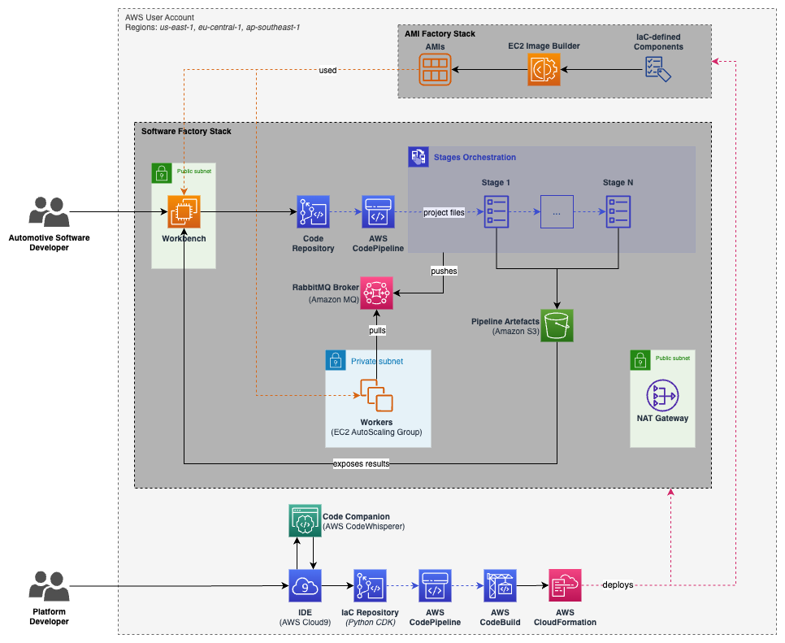
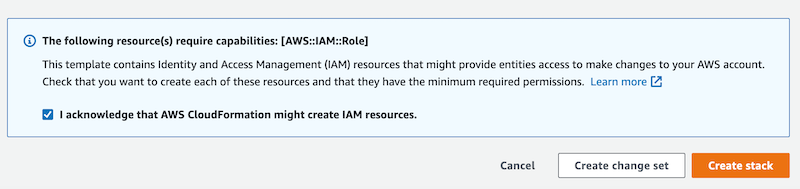

# Welcome to the Automotive Software Developer Workbench

AWS is revolutionizing the way automotive software is being developed, providing automakers with the infrastructure, tools, and partner ecosystem needed to enable software-first development organizations.  
The Automotive Software Developer Workbench aim to provide a holistic overview of how the cloud can help to scale and accelerate automotive software development, showcasing a workbench, a software and an AMI factory.
This repository contains the instructions and code that allows you to deploy a full end-to-end example that will let you experiance what a developer experiance for various automotive software stack would look like.
While we currently support only a Model-based design workflow for AUTOSAR Classic Platform based on ETAS toolchain but we plan additional examples in the coming future.

## Getting started

Deploy Cloud 9 in one of the supported regions

Acknowledge the creation of the stack and press the button **Create stack** on the bottom right. 

The [AWS Cloud9](https://aws.amazon.com/pm/cloud9) IDE instance will take about **3 minutes** to be created.

Choose among the blueprints below and follow the instruction shown in the associated section

- [Model-based design workflow for AUTOSAR Classic Platform](blueprints/etas-autosar-cp/README.md)

## Security

See [CONTRIBUTING](CONTRIBUTING.md#security-issue-notifications) for more 
information.

## License

This code is licensed under the MIT-0 License. See the LICENSE file.
