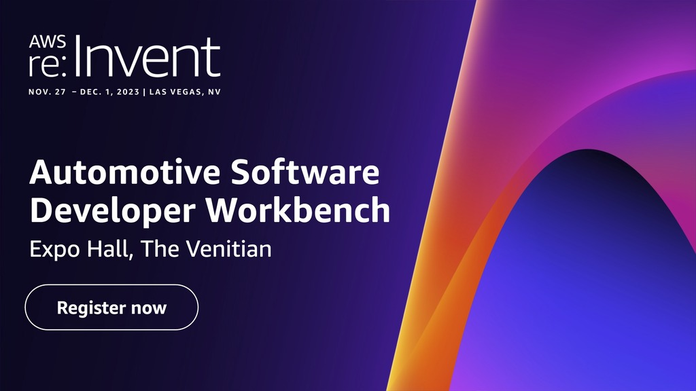

# Welcome to the Automotive Software Developer Workbench

AWS is revolutionizing the way automotive software is being developed, providing automakers with the infrastructure, tools, and partner ecosystem needed to enable software-first development organizations.  

Come at **[AWS re:Invent 2023](https://reinvent.awsevents.com/)** and we will provide a holistic view of how the cloud can help to scale and accelerate automotive software development, showcasing a virtual engineering workbench, a software and an AMI factory.
Soon after **[AWS re:Invent 2023](https://reinvent.awsevents.com/)**, this repository will contains the instructions and code that allows you to deploy an end-to-end example of Model-based design workflow for AUTOSAR Classic Platform based on **[ETAS](https://www.etas.com/)** toolchain.

