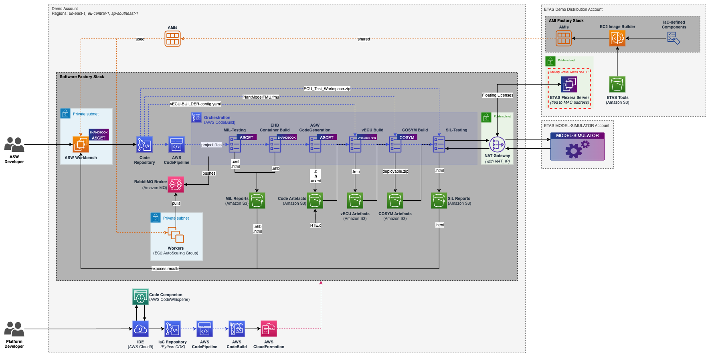
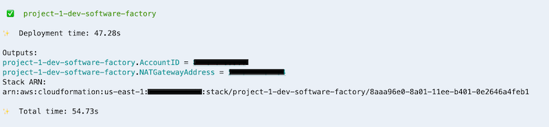
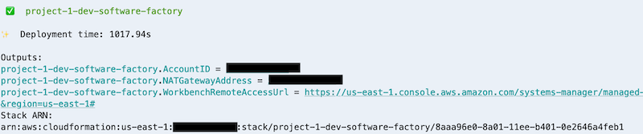
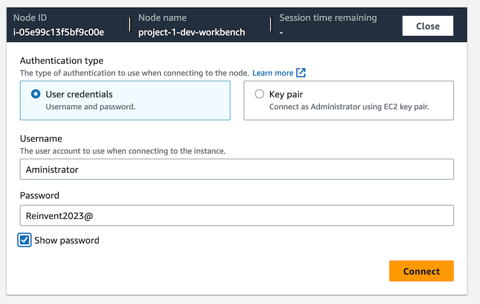
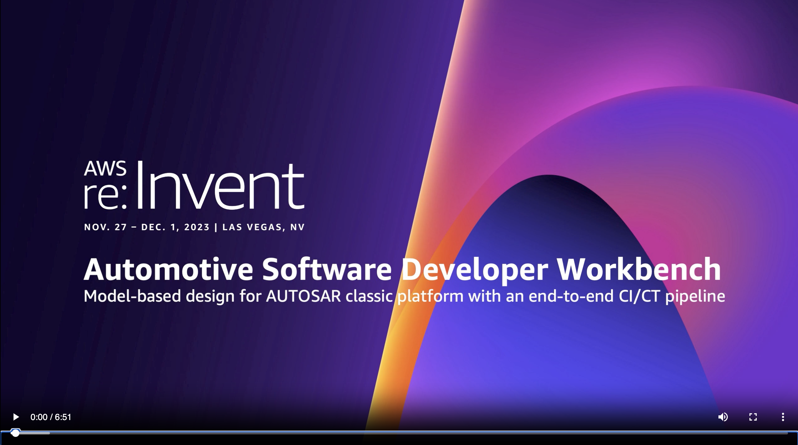

# Model-based design workflow for AUTOSAR Classic Platform

This demo showcases how to design and test on AWS an in-vehicle application based on AUTOSAR classic platform using a model-based approach. A developer connects to his Workbench, specifically crafted for the project, via a web browser-based client with Remote Desktop Protocol (RDP). The workbench comes will all the tools he needs to design the application, such as ETAS ASCET-DEVELOPER and EHANDBOOK-NAVIGATOR. Before committing to the project repository, he can locally execute the application at model level and verify that all the developed tests do pass. At every code commit, the project pipeline is trigged and a full suite of model-in-the-loop (MiL) tests is executed at scale. If MiL stage passes successfully, C code is generated. This code and already-available Basic Software (BSW) are fed into ETAS vECU-BUILDER which produces a model of the ECU in FMU format (vECU model). At last, the vECU model is bundled with the Plant Model FMU model using ETAS COSYM. Software-in-the-loop (SiL) tests are then executed at scale with ETAS MODEL SIMULATOR, with test specifications designed with TraceTronic ECU-TEST. MiL-tests and SiL-tests reports are exposed to the workbench, where the developer can analyse them, thus closing the loop. The whole architecture can be configured and deployed via infrastructure-as-code (IaC), based on CDK and Python, and empowers anyone with an AWS account to test this workflow.

This demo aligns AWS' efforts in revolutionizingng automotive software development with ETAS' [Continuous Development Workbench](https://www.etas.com/en/products/continuous-development-workbench.php).

## Architecture



## Deploy

If you got here from the [main page](../../README.md), resume your [CloudShell session](https://console.aws.amazon.com/cloudshell/home#). Otherwise, please refer to the main [Getting Started](../../README.md#getting-started) section, and come back here. It will only take a few minutes.

Issue the following commands:

```sh
cd ~/asdw
./scripts/deploy etas-autosar-cp
```

The `deploy` script will take about **1 minute** to complete and will print the AWS account ID and NAT gateway address



With the above information, request access to the assets and licenses filling [**this form**](https://www.etas.com/en/portfolio/registration-continuous-development-workbench.php). ETAS will provide you access to the required tools free of charge.

When you have been granted access from ETAS, you will need to rerun the `deploy` script:

```sh
cd ~/asdw
git pull
./scripts/deploy etas-autosar-cp
```

This second `deploy` run will take about **18 minutes**. Afterwards, please allow another **10 minutes** before accessing the workbench, then click the link printed by `deploy`:



and connect using with the following credentials:

Username: `Administrator`

Password: `Reinvent2023@`



The above step relies on Fleet Manager, a capability of [AWS Systems Manager](https://docs.aws.amazon.com/systems-manager/latest/userguide/what-is-systems-manager.html), to connect to your workbench using the Remote Desktop Protocol (RDP). [Fleet Manager Remote Desktop](https://docs.aws.amazon.com/systems-manager/latest/userguide/fleet-rdp.html), which is powered by NICE DCV, provides a secure connectivity to a Windows Server instance directly from the Systems Manager console.

You're good to go!

## Demo walkthrough 

Now what? You can follow the re:Invent 2023 demo steps shown in the video below. As you will not be using the Virtual Engineering Workbench the relevant part starts at 1:40.

[](https://www.youtube.com/watch?v=8cUedpXNTbY&ab_channel=AmazonWebServices)

## Tools Details

- [ETAS ASCET-DEVELOPER](https://www.etas.com/en/products/ascet-developer.php) is a professional development tool that can be used to model functions and generate C code based on graphic models and text-based programming notations. ETAS ASCET-DEVELOPER allows you to efficiently develop high-performance, easy-to-maintain, secure application software for embedded systems.

- [ETAS EHANDBOOK](https://www.etas.com/en/products/ehandbook.php) is an award-winning solution that combines multiple document files from different development sources into an easy-to-use, interactive format. ETAS EHANDBOOK saves you valuable time by understanding complex ECU applications faster.

- [ETAS VECU-BUILDER](https://www.etas.com/en/products/vecu-builder.php) is a tool for the generation of virtual ECUs as FMU for the verification and validation of automotive microcontroller software in Software-in-Loop (SIL) setups. ETAS VECU-Builder allows you to generate stand-alone, executable virtual ECUs for comprehensive cooperation with OEMs and suppliers.

- [ETAS COSYM](https://www.etas.com/en/products/cosym-co-simulation-platform.php) is a powerful simulation and integration platform for testing and validating software in all phases of software development. ETAS COSYM helps to reduce costs and time by moving HiL tests forward to virtual simulation (MiL/SiL).

- [ETAS MODEL-SIMULATOR](https://www.etas.com/en/applications/software-in-the-loop-testing-in-the-cloud.php) is a platform for parallel simulation, test execution and driving cycle generation. Allowing you to significantly increase the simulation speed, receive fast feedback and detect errors at an early stage – all while maintaining data security in according to ISO 27001.

## Cleanup

From [CloudFormation](https://console.aws.amazon.com/cloudformation/home) just delete `project-1-dev-software-factory` and `asdw-cloud9` stacks.
[NOTE: Need to delete also the buckets]